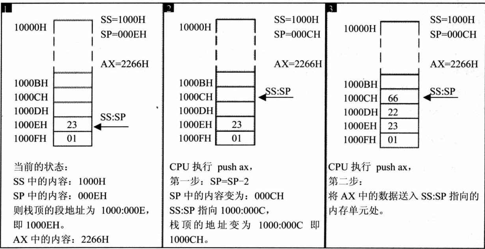
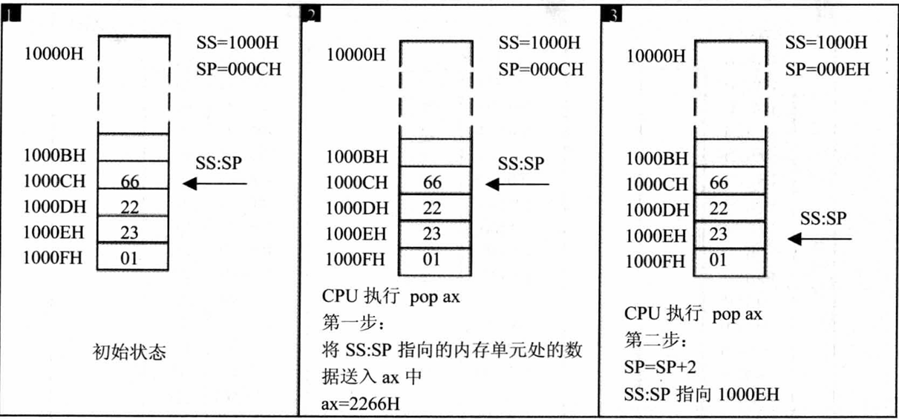
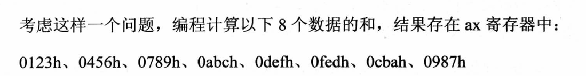
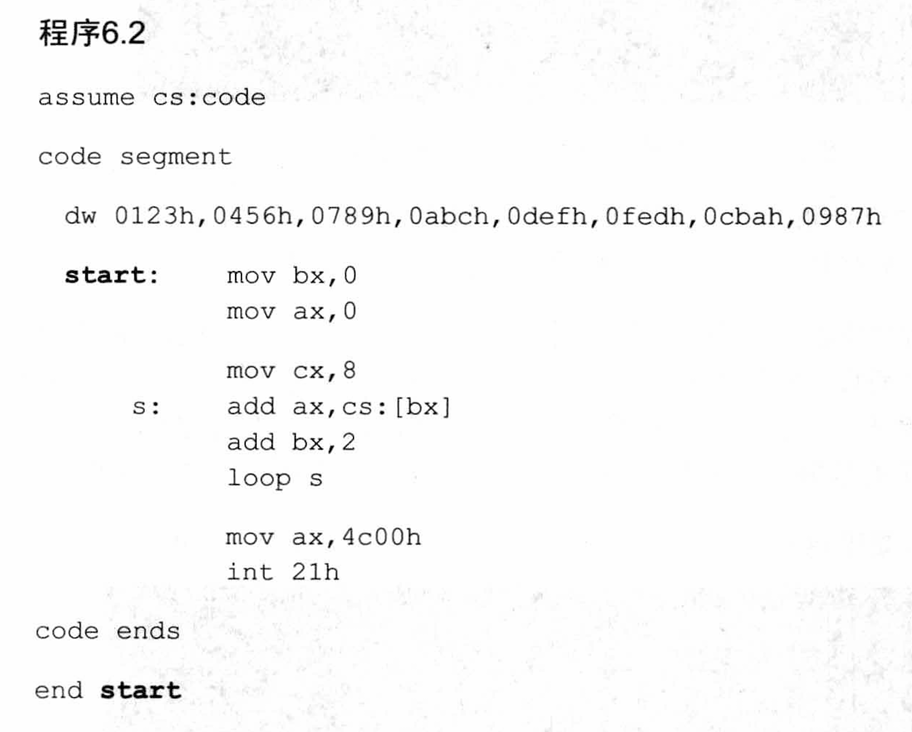
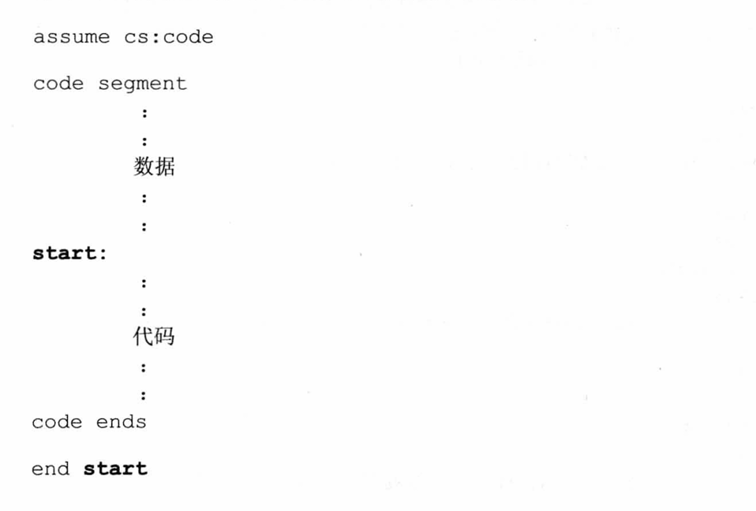
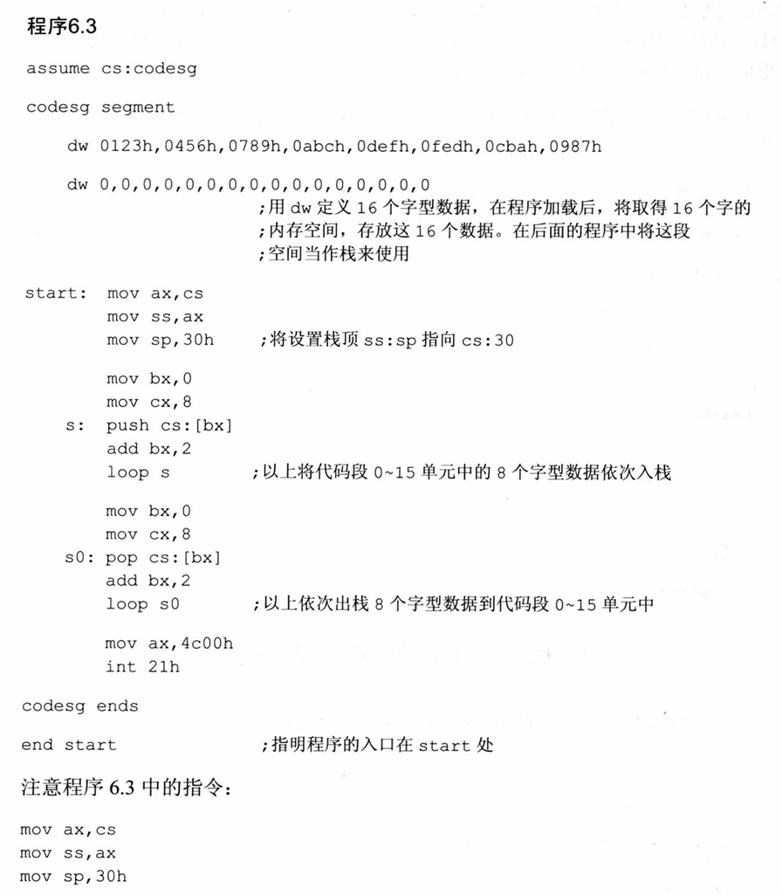
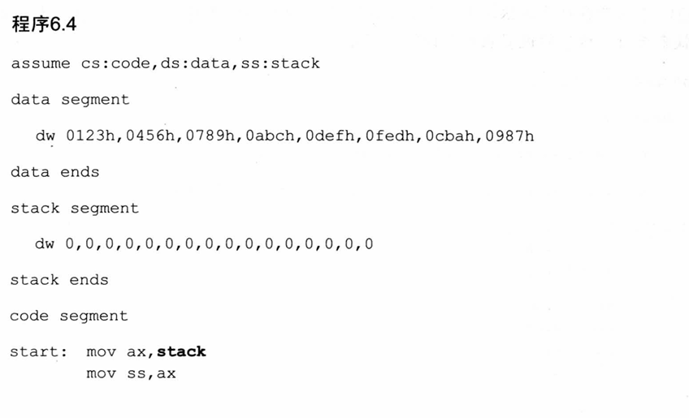
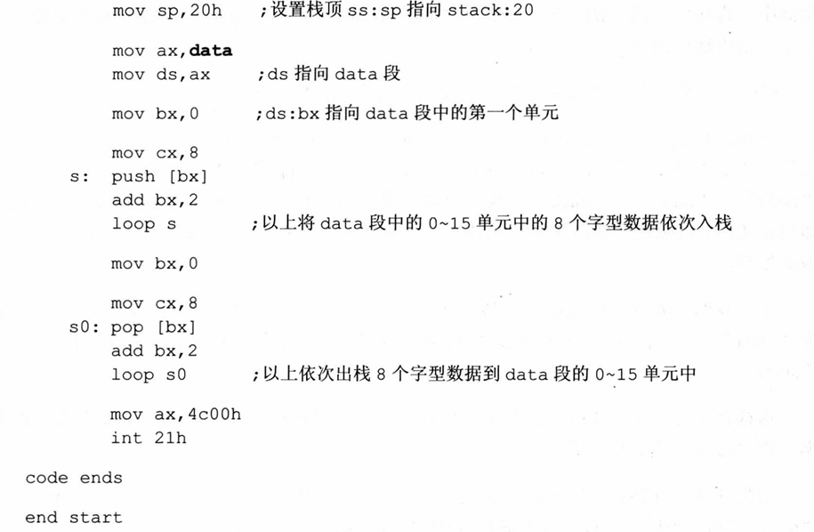

## 汇编语言学习

暂时没有啥条理，等之后有时间一定整理一下（也可能忘记了或者单纯的懒完全没整理）

#### 通用寄存器

AX可存16位 但AL或者AH只能存8位

例如：AX的数据为001A 则AH中保存的数据为**00** 而AL中保存的数据为**1A** 

也就是说，001A在地址的视角中应该是**1A 00**

#### 不通用寄存器

##### DS

一般用DS寄存器来存放要访问的数据的段的地址

若想改变DS寄存器中的内容，只能通过将数据传入其他通用寄存器之后，再使用mov命令将该通用寄存器中的内容传入DS中

##### CS:IP

从CS:IP指向的内存单元读取指令，读取的指令进入指令缓冲器;
P=IP+所读取指令的长度，从而指向下一条指令;
执行指令。转到步骤(1)，重复这个过程。

**CS:IP先变化再执行指令**

#### 段的概念

A:B的真实地址是A*16+B

2000:B这个地址的真实值是2000B

#### 栈的概念

栈寄存器为SS:SP



入栈时，栈顶从高地址向低地址的方向增长

栈空时，栈顶指针指向最高地址的的下一个单元（最高地址+1）



出栈是，是先将数据输送至指定寄存器，再变化指针。原数据不会被删除，而是等待被覆盖

### 第五章

#### Loop指令

 CPU执行loop指令时，要进行两步操作。

1.(cx) = (cx)-1

2.判断cx中的值

举例：

```
assume cs :code
code segment
	mov ax,2
	;做 11 次 add ax,ax
	;下面两行就当是return 0
	mov ax,4c00h
	int 21h
code ends
end
```

11次太长了，用loop简化一下

```
assume cs :code
code segment
	mov ax,2
	
	mov cx,11
s:	add ax,ax
	loop s
	;做 11 次 add ax,ax
	;下面两行就当是return 0
	mov ax,4c00h
	int 21h
code ends
end
```

由上可知，loop的用法是先定义循环次数，将循环次数存入cx。

再定义循环语句 s。

最后使用loop s来实施循环。

#### Debug和编译器masm对指令的不同处理

形如 mov al,[0] 的这类指令在Debug中编程正常实现，但是在汇编程序中便出现了问题。 Debug会将[0]解释成内存单元，其中的0为内存的偏移地址；而编译器将[0]直接解释为0。

因此，如果我们需要在汇编程序中实现mov al,[0] 的指令，需要将其转变为 mov al,ds:[0]便可以正常运行 

#### loop和[bx]的联合应用

问题：计算ffff:0~ffff:b（12个8位数据）单元中的数据的和，将结果存储在dx（16位寄存器）中。

两个方法：

​	①(dx) = (dx) + 内存中的8位数据

​	②(dl) = (dl) + 内存中的8位数据

第一种方法的问题是两个运算对象类型不匹配，无法运算（dx位16位寄存器，但是数据只有8位）。

第二种方法的问题是结果可能超界。

解决方法：利用ax作为中介，一次运送一个单元的数据到al，在将ah设为0。利用add dx,ax 将结果输入进dx。重复多次，直到将12个单元的数据全部存入dx。

最终解决方案：

```
assume cs:code
code segment
	
	mov ax,0ffffh
	mov ds,ax
	mov bx,0              ;初始化ds:bx指向ffff:0
	
	mov dx,0              ;初始化累加寄存器 使(dx)=0
	
	mov cx,12             ;初始化循环寄存器cx = 12
	
s:  mov al,[bx]
	mov ah,0
	add dx,ax
	inc bx
	loop s
	
	mov ax,4c00h
	int 21h
	
code ends
end
```

### 第六章

#### 在代码中使用具体的数据



前面我们不关心数据本身，只关心累加某些指定内存中的数据。

题解如下：



如上所示，先使用dw定义所需的具体的数据，在使用start语句可以定义代码从何处开始运行，在最后需要写上end start。

框架如下所示：



#### 在代码段中使用栈

完成程序，将程序中定义的数据逆序存放。

思路：定义的数据肯定是存放在cs:0-cs:F中，共八个字单元。先将这些单元中的数据入栈，再依次出栈到这八个单元中，即可实现程序的逆序存放。

问题：我们需要有一段可以当作栈的内存空间。这段空间需要由系统来分配。

题解如下：



#### 将数据、代码、栈放入不同的段

上两小节提到如何在程序中使用具体数据和栈，将数据、栈、代码放到了一个段里面，如此便会出现两个问题：

 	1. 使程序太过混乱
 	2. 代码可能没问题，但是加上数据和栈的大小可能超过了一个段的段长

解决方法便是：用定义代码段（codesg segment）的方式来定义多个段

程序6.3的改进：





我们有了data、stack、code三个段了，那该如何访问段呢？我们需要段地址。data段的段地址就叫做data。

如果我们要访问data段中的第4个数据0abch，代码如下：

```
mov ax,data
mov ds,ax
mov bx,ds:[6]
```

不能将data直接传入段寄存器ds中。

源程序前的指令

```
assume cs:code,ds:data,ss:stack
```

是什么意思呢？是将cs、ds、ss分别和code、data、stack段相连。

### 第七章

and 和 or 指令：

想将一段数据的某一位设置为0：and指令

想将一段数据的某一位设置为1：or指令

将第一段字符设置为全大写，将第二段字符设置为全小写

```
assume cs:codesg,ds:datasg

datasg segment
        db 'BaSiC'
        db 'iNfOrMaTiOn'
datasg ends

codesg segment
        start:
        mov ax,datasg
        mov ds,ax
        mov bx,0
        mov cx,5
        s: mov al,[bx]
        and al,11011111B
        mov [bx],al
        inc bx
        loop s

        mov bx,5
        mov cx,11
        s1:mov al,[bx]
        or al,00100000B
        mov [bx],al
        inc bx
        loop s1

        mov ax,4c00h
        int 21h


        codesg ends
        end start
```

之后可使用d ds:0000可查看更改后的字符。
