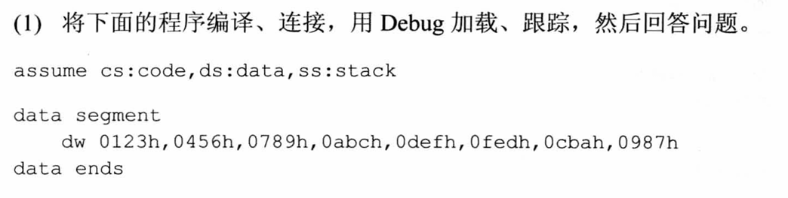
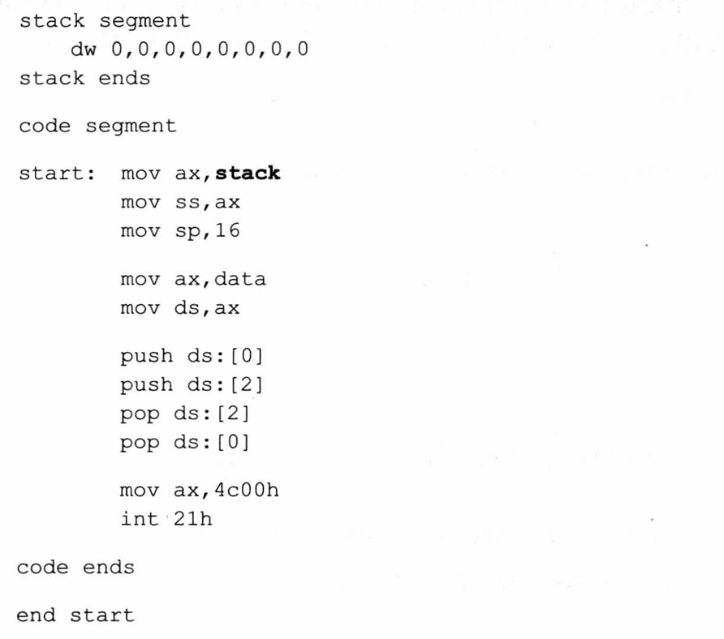
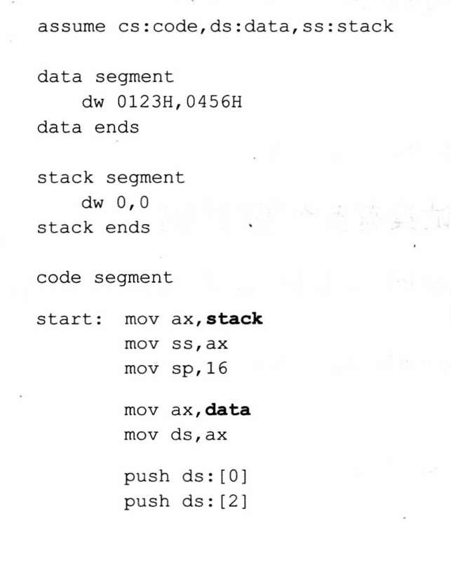
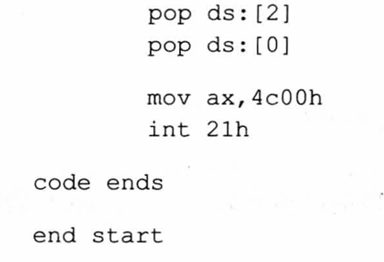
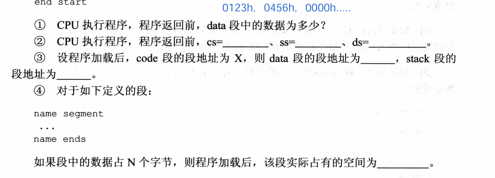

### 实验4


```
assume cs:code
code segment
	
	mov dx,0
	mov ds,dx
	mov bx,0200h
	;dx:bx

	
	mov cx,64
	
s:  mov al,dl
	mov [bx],ax
	inc dx
    inc bx
	loop s
	
	mov ax,4c00h
	int 21h
	
code ends
end
```


### 实验5






分别为X-2和X-1:因为每次定义一个段便会占用一整个段长。


但是如果我们定义data段和stack段时，没有主动初始化一个段长的数据呢？





**首先明确：**虽然我们在 data段 和 stack段 中只定义初始化了4个字节的内存，但在汇编中，直接给你分配了16个字节的空间，不足的按00补全。

**结论：**数据段和栈段在程序加载后实际占据的空间都是以16个字节为单位的。如果不足，以0补全填充。



第四题解答：若小于16个字节（最小段长）则实际占有空间为16个字节；若大于16个字节，则实际占有空间用00扩充至16个字节为单位。


下一个是将data段和stack段放到了code段后面。

我们查看cs寄存器时可知code有三个段长。

> 四。 如果将(1)、(2)、(3题中的最后一条伪指令“end start”改为“end”(也就是说不指明程序的入口)，则那个程序仍然可以正确执行？请说明原因。
>
>  
>
> ​    **答案：**如果不指名程序的（code段的）入口，并且使用 end 替换 end start，都能正常运行。但只有（3）题中程序可以正确的执行（因为只有它是在内存中可执行代码在最前面）。
>
> ​    **讲解：**因为如果不指名入口，程序会从加载进内存的第一个单元起开始执行，前二个题中，定义的是数据，但CPU还是将数据当做指令代码执行了。只不过程序执行时逻辑上是错误了。但真的能执行的。
>
> ​    如果指明了程序的入口，CPU会直接从入口处开始执行真正的机器码，直到遇到中断指令返回。此种方式能够确保程序逻辑上的正确。因此有必要为程序来指明入口。

