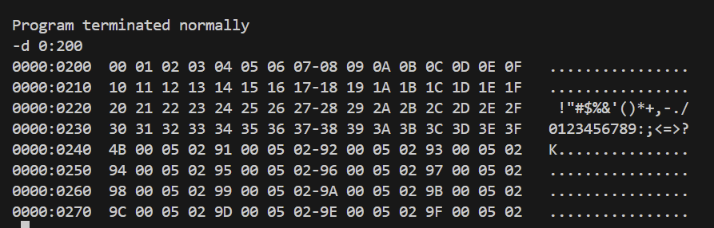

### 实验4


```
assume cs:code
code segment
	
	mov dx,0
	mov ds,dx
	mov bx,0200h
	;dx:bx

	
	mov cx,64
	
s:  mov al,dl
	mov [bx],ax
	inc dx
    inc bx
	loop s
	
	mov ax,4c00h
	int 21h
	
code ends
end
```




### 实验5

